# ISA-Project-GuardiaCostiera
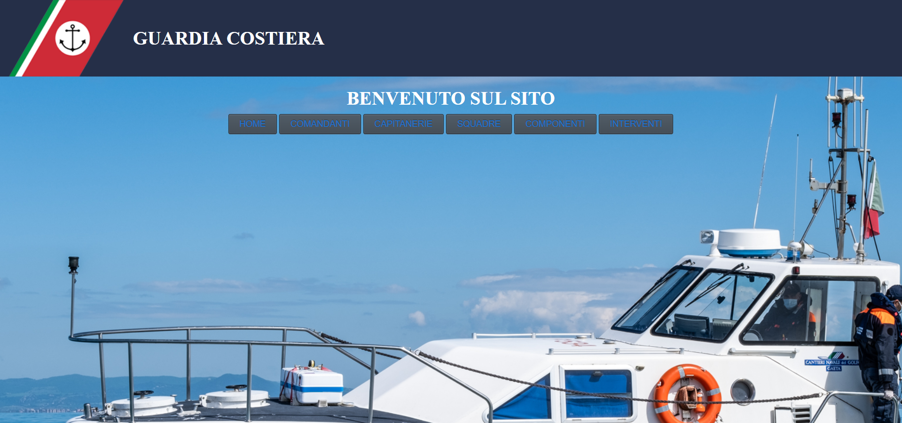

# Specifica dei requisiti
Consultabile al link:
	https://docs.google.com/document/d/1BRvH9lCYLaBEv_zfXyfi3pHYUEfEXnvj17nHbGmQLRk/edit?usp=sharing

## Introduzione
Il progetto è una semplice applicazione Web che simula la gestione di Capitanerie della Guardia Costiera. 
Progetto interamente realizzato ai fini dell'esame di Ingegneria del software avanzata.

Questa applicazione Web permette agli utenti di:
- Visualizzare, modificare, inserire ed eliminare comandanti. 
- Visualizzare, modificare, inserire ed eliminare capitanerie a cui vengono assegnati dei comandanti.
- Visualizzare, modificare, inserire ed eliminare squadre di azione.
- Visualizzare, modificare, inserire ed eliminare componenti di una squadra.
- Visualizzare, modificare, inserire ed eliminare interventi assegnati alle squadre.

## Struttura del sistema
Il sistema è basato su di un'architettura a strati di tipo MVC. 
Composto da:
- Controller -> responsabile di elaborare le richieste web degli utenti.
- Model -> responsabile di gestire le informazioni di interesse dell’applicazione.
- View -> responsabili di visualizzare le risposte e le informazioni del modello agli utenti.

## Diagramma UML
Il diagramma UML, generato automaticamente dall'IDE NeatBeans mediante plug-in easyUML, è il seguente:
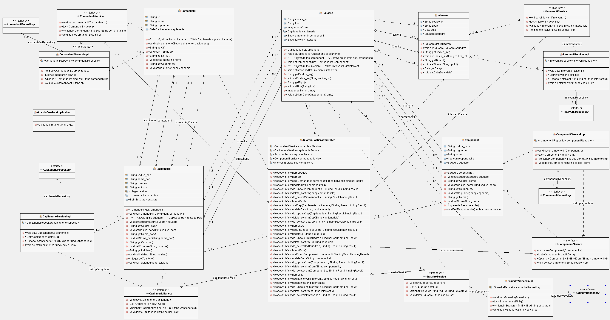

## Funzionamento del sistema
Per la realizzazione del progetto si è utilizzato Spring Boot, il quale semplifica la creazione di applicazioni Spring autonome di livello produttivo che possono essere "semplicemente eseguite".
E' Spring Boot a occuparsi di identificare, creare e configurare (automaticamente e in modo intelligente) tutti i componenti e le dipendenze necessari per l’applicazione.
La parte fondamentale di back-end, si occupa in primis di stabilire una connessione col database attraverso il file "application.properties", nel quale sono definite le caratteristiche del db,
per poi andare a comunicare succesivamente mediante l'implementazione delle corrispettive classi.
Nelle classi sono presenti attributi e metodi che permettono di eseguire una corretta gestione dei dati, inoltre sono presenti dei join mediante delle strutture dati di tipo Set che permettono di visualizzare dati corrispondenti alle classi comunicanti.
L'elemento di congiunzione tra front-end e back-end è la classe "GuardiaCostieraController.java" che, data una pagina web all'utente, si occupa di gestire le operazione ma anche di segnalare eventuali errori o reindirizzamento delle pagine html.

## Tecnologie adoperate
* [Maven] - Per la gestione di dipendenze software.
* [NetBeans V8.2] - IDE
* [PostgreSQL v12.3] - Per la gestione del database interagendo mediante PgAdmin.
* [Spring Boot] - Framework molto semplice per la creazionedi applicazioni Web
* [Thymeleaf] - Per la parte View di un MVC, si è fatto uso dei template di Thymeleaf
* [Junit 5] - Per eseguire test lato model
* [JUnit Quickcheck] - Per effettuare il property-based testing.
* [Selenium] - Per eseguire test automatizzati simulando interazione browser.

### Database
#### Struttura
La struttura del database è la seguente: \
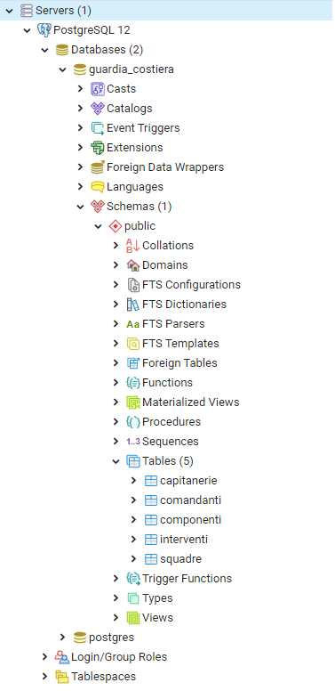

La connessione al database avviene tramite JDBC
	spring.datasource.url = jdbc:postgresql://localhost/guardia_costiera

#### Schema logico
Lo schema logico è il seguente:
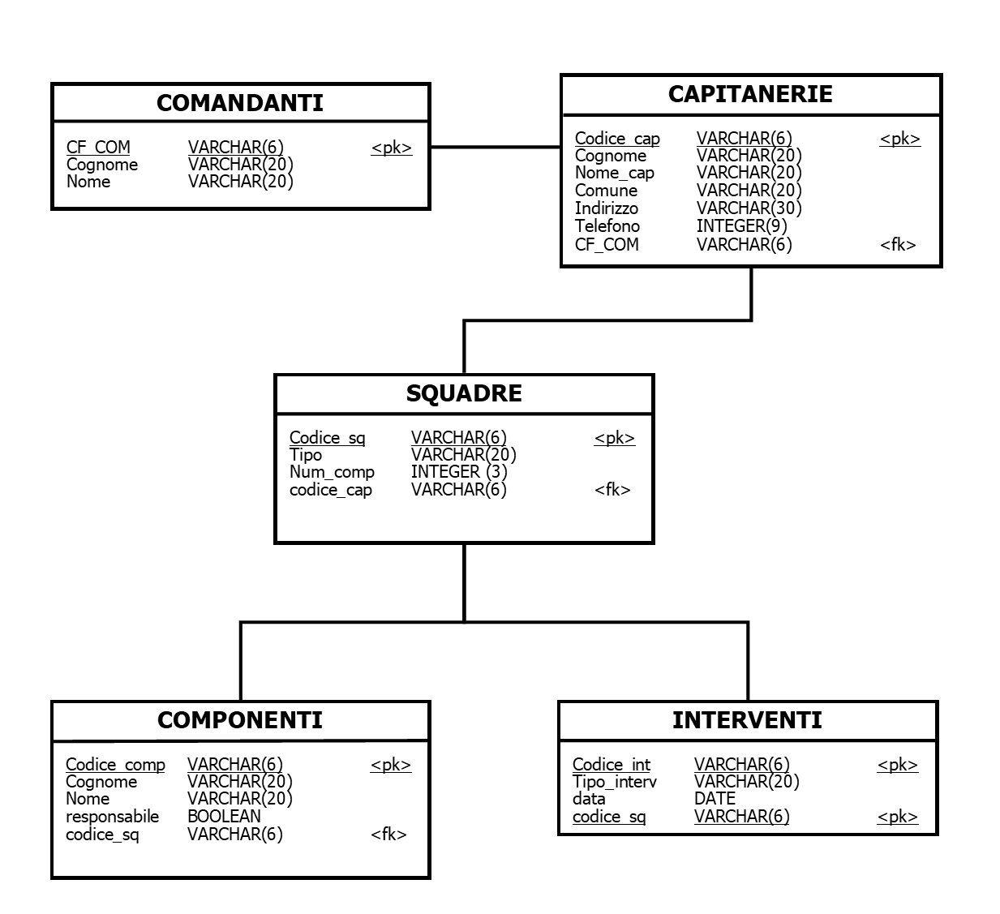 \

### Fasi di Test
Il progetto prevede l'utilizzo di alcuni test automatizzati. Essi sono suddivisi in unit test ed integration test. \
Gli unit test sono volti a testare i modelli (tramite property-based testing) con lo scopo di testare tutti i metodi GET delle classi definite. 
Per testare le proprietà, all'interno del package "com.ap.generate" sono state definite una serie di classi che consentono di generare stringhe, numeri e date in modo random. \

Gli integration test testano invece si occupano di controllare corretto funzionamento del sistema in un tipico caso d'uso, simula l'interazione dell'utente con il browser, cliccando su link
e pulsanti, ma anche inserendo e modificando i valori all'interno delle caselle di testo presenti nella view.

### Java DOC
La documentazione prodotta non è esaustiva, ma permette di comprendere package,metodi e classi presenti all'interno del progetto realizzato.
La realizzazione è avvenuta mediante l'utilizzo del comando "Generate Javadoc" all'interno dell'IDE NetBeans e presente all'interno della cartella "target/site".

## Di seguito alcune schermate di esempio

#### Inserimento Comandanti
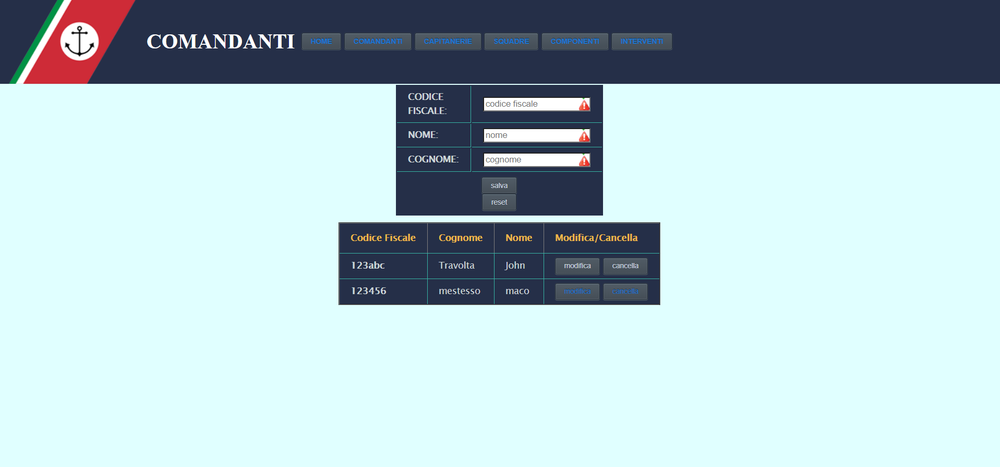

#### Modifica di un comandante
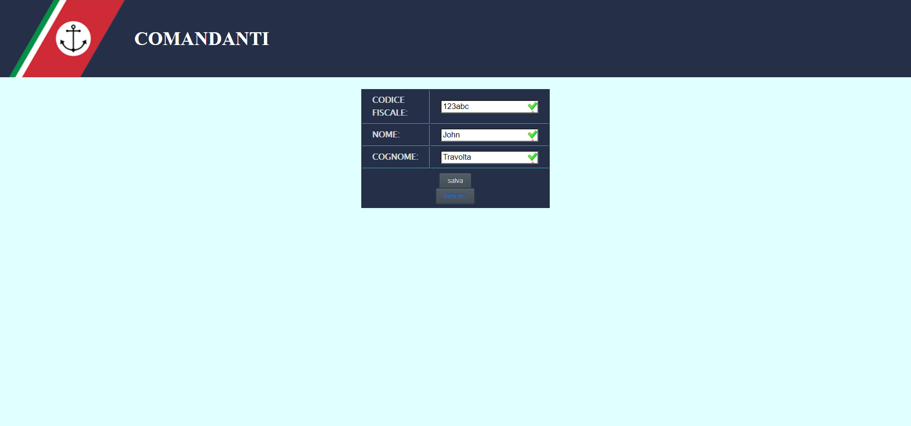

#### Eliminazione di un comandante
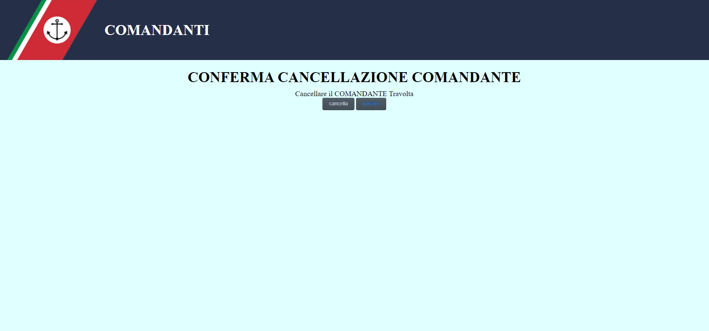

#### Inserimento di una Capitaneria
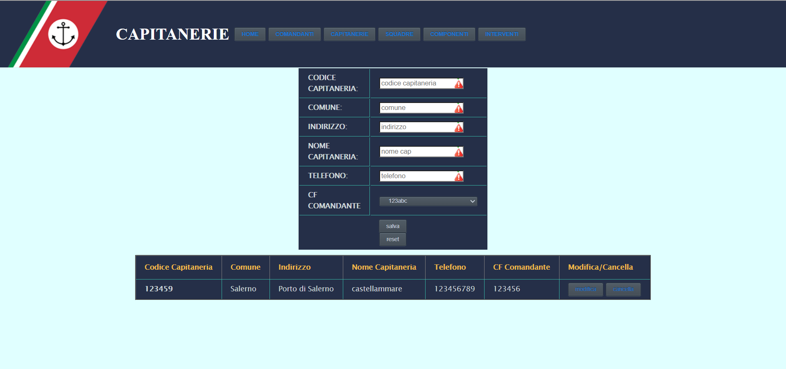

#### Inserimento di una squadra
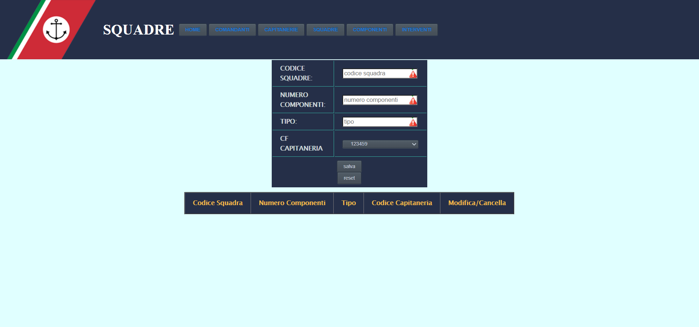

#### Inserimento di un componente
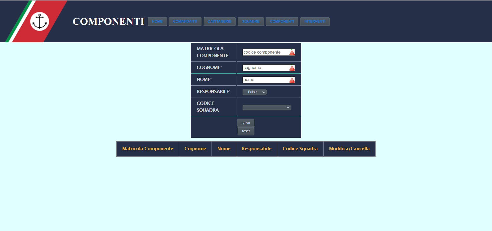

#### Inserimento di un intervento
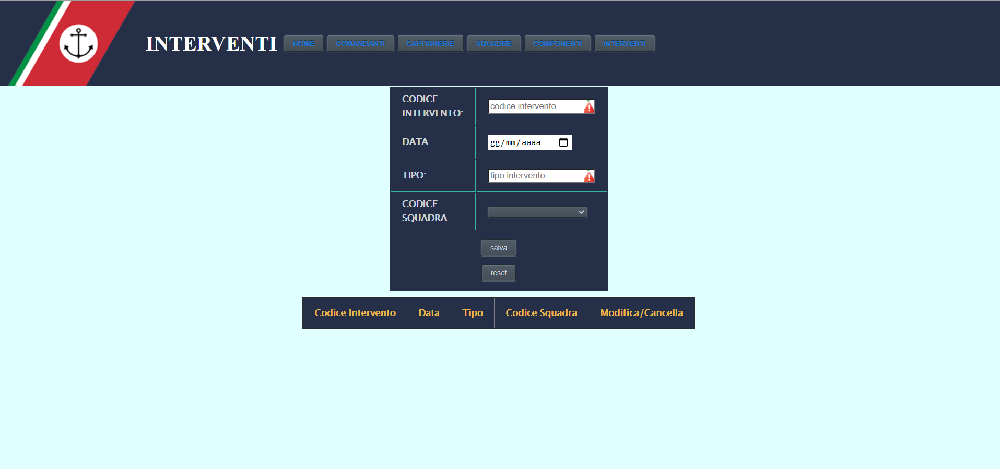